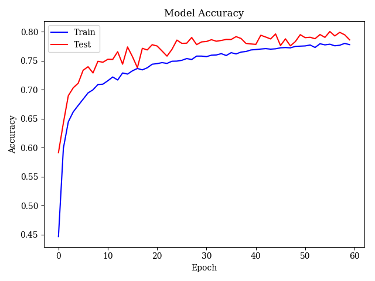
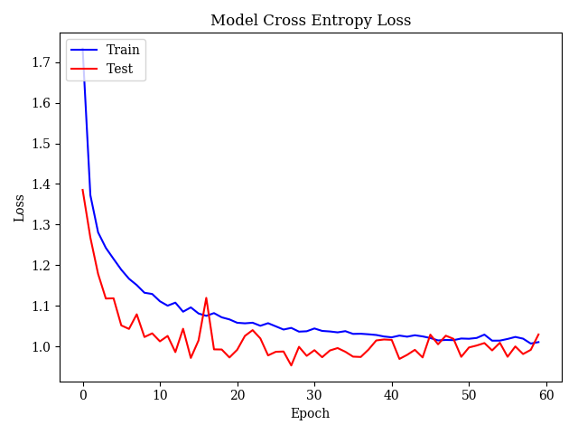
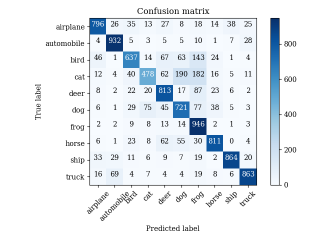
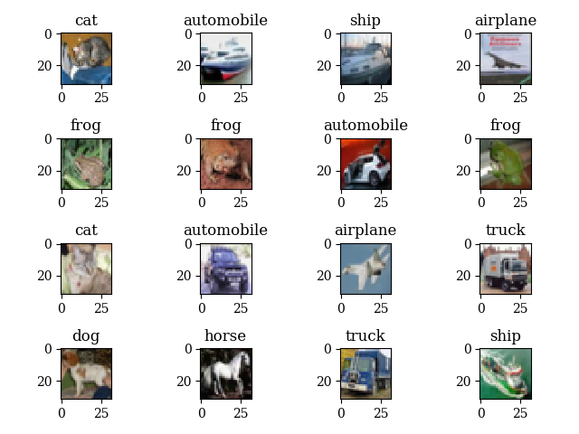

# Convolutional Neural Network for CIFAR-10 Classification using TensorFlow and Keras
| Rory Conlin
| APC 490

## Network Architecture
The initial design for the CNN consisted of a convolutional layer, max pooling, and softmax. After training, it was only able to achieve ~60% accuracy. To improve this, research was done on existing designs for neural nets for image recognition, and following suggestions given on Stanford cs231n's Github page^[https://cs231n.github.io/convolutional-networks/], the network was improved by adding additional convolutional layers, followed by max pooling and dropout layers. This pattern was repeated several times, each time increasing the number of convolutional filters. The final result was a network of 10 convolutional layers, with between 16 and 512 filters each, interspersed with 4 maxpool layers and 5 dropout layers, capped off by a dense softmax layer to do the final classification.

During testing it was found that the accuracy on the training samples was much higher than that on the test samples, suggesting that the network was overfitting, so L2 regularization was added to each convolutional layer. Additionally, after experimenting with several different activation functions, it was determined that ELU (exponential linear units) slightly outperformed ReLU and other common activations. For training, a categorical cross entropy loss function was used, and after some experimentation and research, it was determined that the Adam algorithm provided the best results. The network was trained for 60 epochs (ie, 60 passes through the entire training dataset) with a minibatch size of 100.

The architecture of the final network is summarized below. The network was implemented using the Keras API for TensowFlow, which allows for faster prototyping, as the user need only specify the layer architecture, rather than specifying individual tensors.

~~~~~
_________________________________________________________________
Layer (type)                 Output Shape              Param #
=================================================================
conv2d_1 (Conv2D)            (None, 32, 32, 16)        448
_________________________________________________________________
conv2d_2 (Conv2D)            (None, 32, 32, 16)        2320
_________________________________________________________________
dropout_1 (Dropout)          (None, 32, 32, 16)        0
_________________________________________________________________
conv2d_3 (Conv2D)            (None, 32, 32, 32)        4640
_________________________________________________________________
conv2d_4 (Conv2D)            (None, 32, 32, 32)        9248
_________________________________________________________________
max_pool_1 (MaxPooling2D)    (None, 16, 16, 32)        0
_________________________________________________________________
dropout_2 (Dropout)          (None, 16, 16, 32)        0
_________________________________________________________________
conv2d_5 (Conv2D)            (None, 16, 16, 64)        18496
_________________________________________________________________
conv2d_6 (Conv2D)            (None, 16, 16, 64)        36928
_________________________________________________________________
max_pool_2 (MaxPooling2D)    (None, 8, 8, 64)          0
_________________________________________________________________
dropout_3 (Dropout)          (None, 8, 8, 64)          0
_________________________________________________________________
conv2d_7 (Conv2D)            (None, 8, 8, 128)         73856
_________________________________________________________________
conv2d_8 (Conv2D)            (None, 8, 8, 128)         147584
_________________________________________________________________
max_pool_3 (MaxPooling2D)    (None, 4, 4, 128)         0
_________________________________________________________________
dropout_4 (Dropout)          (None, 4, 4, 128)         0
_________________________________________________________________
conv2d_9 (Conv2D)            (None, 4, 4, 256)         295168
_________________________________________________________________
conv2d_10 (Conv2D)           (None, 4, 4, 512)         1180160
_________________________________________________________________
max_pool_4 (MaxPooling2D)    (None, 2, 2, 512)         0
_________________________________________________________________
dropout_5 (Dropout)          (None, 2, 2, 512)         0
_________________________________________________________________
flatten (Flatten)            (None, 2048)              0
_________________________________________________________________
dense (Dense)                (None, 10)                20490
=================================================================
Total params: 1,789,338
Trainable params: 1,789,338
Non-trainable params: 0
_________________________________________________________________
~~~~~

## Results
The network was able to achieve an accuracy of 77.8% on the training data, and 78.6% on testing data after training for 60 epochs. Plots of the model accuracy and value of the loss function at each epoch are shown below.

It is possible that further training would improve performance, as the plots show that the training accuracy had not fully plateaued. However, due to time limitations and the number of different network architectures tested, it was not feasible to train for longer.

The confusion matrix for the classes is shown below. Overall accuracy is high, with the most commonly misclassifications occurring between cats/dogs/frogs and automobile/trucks, which is to be expected given the visual similarity of the objects.

A sampling of images from the test set is shown below along with their predicted labels. The only incorrect label is the second item in the first row, which is misclassified as an automobile, instead of a ship. Overall this is very impressive, as even several humans polled could not correctly identify all of the images given their small size.

Though it is likely that the network could be further improved with additional layers, there was not enough computational power available to train a larger network efficiently. Even training on GPUs would take at least 1 hour, and larger networks exceeded available GPU memory, significantly slowing down the training.
